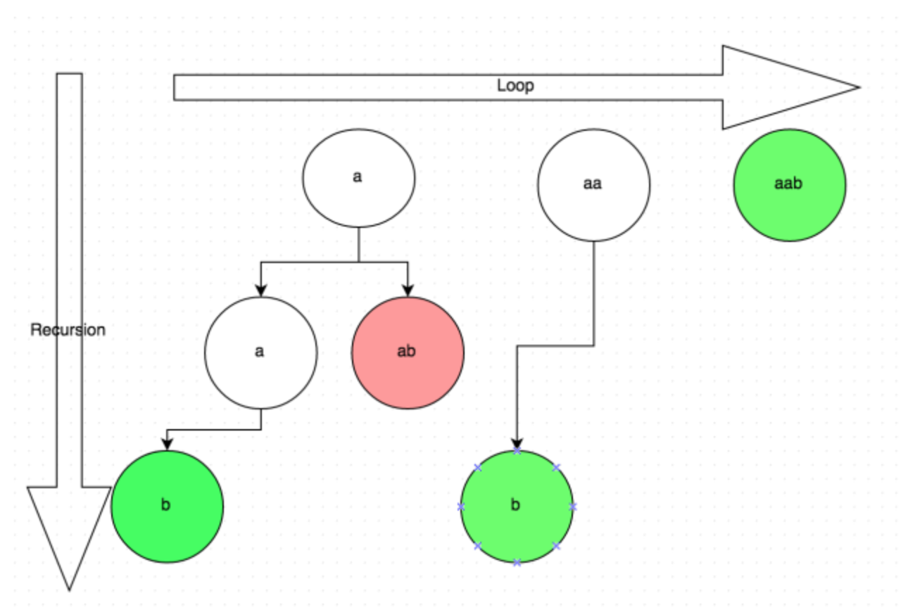

# 题目

给定一个字符串 *s*，将 *s* 分割成一些子串，使每个子串都是回文串。

返回 *s* 所有可能的分割方案。

**示例:**

```
输入: "aab"
输出:
[
  ["aa","b"],
  ["a","a","b"]
]
```

# 题解

这算是backtrack的经典题目了。首先我们需要一个`isPalindrome` 函数判断是不是回文字符串，思路很简单，就是从字符串的两端检查到中间。接下来就是backtrack的过程。如下图，从左到右是循环的过程，对于你代码中的for循环，每次循环，字符加一个：a -> aa -> aab。而每次递归就是进入子问题进行深度搜索的过程。



```
class Solution {
    public List<List<String>> partition(String s) {
        List<List<String>> res = new LinkedList<>();
        if (s == null || s.length() == 0) { return res;}
        List<String> current = new LinkedList<>();
        helper(res, current, s, 0);
        return res;
    }

    public void helper(List<List<String>> res, List<String> current, String s, int startIndex) {
        if (s.length() == startIndex) {
            res.add(new LinkedList<>(current));
            return;
        }

        for (int i = startIndex; i < s.length(); i++) {
            String currentPartition = s.substring(startIndex, i + 1);
            if (currentPartition.isEmpty() || !isPalindrome(currentPartition)) {
                continue;
            }
            current.add(currentPartition);
            helper(res, current, s, i+1);
            current.remove(current.size() - 1);
        }
    }
    
    public boolean isPalindrome(String s) {
        char[] res = s.toCharArray();
        int left = 0;
        int right = s.length() - 1;
        while (left <= right) {
            if (res[left] !=res[right]) {
                return false;
            }
            left++;
            right--;
        }
        return true;
    }
}
```

# 热门阅读

- [看了很多技术书，为啥仍然写不出项目？](https://mp.weixin.qq.com/s/9r1nZihRrW2FVZVvKg8P3A)
- [【Spring】IOC是啥有什么好处](https://mp.weixin.qq.com/s/VB5MSionhHEGFbdlRIjWDg)
- [百度社招面试题——Redis实现分布式锁](https://mp.weixin.qq.com/s/6_uJ03bMyY8HeUDeb4HxYQ)
- [【Leetcode】114. 二叉树展开为链表](https://mp.weixin.qq.com/s/4IxEj0B_CUW6B46HrZQmdA)


